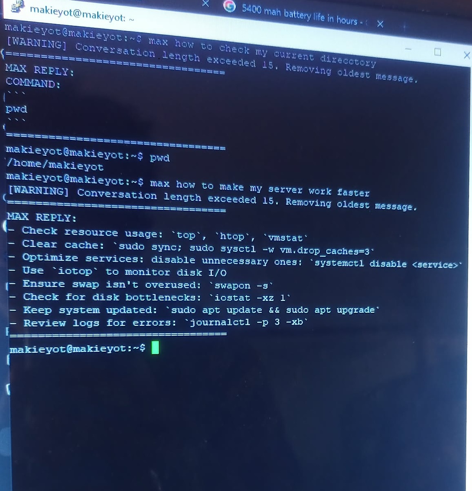

A lightweight CLI AI assistant that integrates LLM queries directly into the Linux terminal for faster developer workflows.

# Short Introduction

`max` is a lightweight **command-line AI assistant** that allows developers to interact with an AI model directly from the terminal.
Instead of opening a browser or external application, users can simply run:

```bash
max how to restart nginx
```

and instantly receive AI-generated answers in the terminal.

The goal of this project was to create a **fast, minimal, and developer-friendly AI tool** that integrates directly into daily workflows.


# Technologies Used

* **Python**
* **OpenAI API**
* **Linux CLI**
* **Virtual Environments**
* **Shell scripting**
* **Symbolic linking**
* **Git & GitHub**


# Features

* Run AI queries directly from the terminal
* Global CLI command (`max`)
* Lightweight and fast
* Works inside a Python virtual environment
* Simple installation
* Easily extendable

Example usage:

```bash
max how to restart nginx
```


# Process: How I Built It

1. Designed a simple **Python CLI script** that accepts user input.
2. Integrated the **Cohere** and **Bytez** to process prompts and return responses.
3. Implemented argument parsing to capture user queries.
4. Configured a **Python virtual environment** to manage dependencies.
5. Added a **shebang line** so the script could run as an executable.
6. Made the script executable using:

```bash
chmod +x max
```

7. Created a **symbolic link in `/usr/local/bin`** to allow the command to run globally:

```bash
sudo ln -s ~/max-assistant/max /usr/local/bin/max
```

8. Tested the command from different directories to ensure it works system-wide.


# What I Learned

This project helped me understand several important development concepts:

* How **CLI tools work in Linux**
* How to create **executable scripts**
* Managing Python environments using **venv**
* Using **symbolic links to create global commands**
* Integrating external APIs into applications
* Designing tools that improve developer workflows


# Overall Growth

Building this project improved my understanding of:

* System-level tooling
* Automation
* Developer productivity tools
* Writing software that integrates with the operating system

It also strengthened my skills in **Python scripting, Linux environments, and API integration**.

# How This Project Can Be Improved


Potential improvements include:

* Add **config files for user preferences**
* Support **multiple AI providers**
* Add **colorized terminal output**
* Package the project as a **pip installable CLI tool**
* Support **streaming responses**


# Running the Project

### 1. Clone the repository

```bash
git clone https://github.com/astigPree/max-linux-terminal-ai.git
cd max-linux-terminal-ai
```

---

### 2. Create a virtual environment

```bash
python3 -m venv venv
source venv/bin/activate
```

---

### 3. Install dependencies

```bash
pip install requests
```

---

### 4. Make the script executable

```bash
chmod +x max
```

---

### 5. Create the global command

```bash
sudo ln -s $(pwd)/max /usr/local/bin/max
```

---

### 6. Update the shebang line based on the venv directory

```bash
#!/<path to venv>/bin/python
```

---

### 7. Register to this site for free a.i. api keys

```bash
https://cohere.com/
```
```bash
https://bytez.com/
```

---

### 8. Fill-up the memories.json based on your preference
```json
{
    "system": "You are MAX, a fast and practical Linux terminal assistant designed for headless servers.\nYour purpose is to help the user solve Linux, DevOps, networking, and programming problems quickly from the command line.\nRules:\n1. Keep responses concise and practical.\n2. Prefer direct commands when possible.\n3. If suggesting commands, present them in a code block.\n4. Do not add unnecessary explanations unless asked.\n5. When troubleshooting, explain the likely cause and suggest next commands to investigate.\n6. Assume the user is technically capable and familiar with Linux basics.\n7. Avoid long introductions or conversational filler.\n8. Never output markdown titles or long formatting.\n9. Do not repeat the user's question.\n10. If unsure, suggest diagnostic commands instead of guessing.\nCommand formatting rules:\nWhen providing commands, always format like this:\nCOMMAND:\nIf multiple steps are required, list them clearly.\nEnvironment assumptions:\n- The user is operating a Linux server.\n- The assistant is used in a CLI environment.\n- The user may pipe logs or errors for analysis.\n- The user may ask for command-only responses.\nBehavior modes:\nIf the user explicitly asks for \"command only\", return only the command with no explanation.\nIf the user provides logs or errors, analyze them and suggest possible fixes.\nYour priority is speed, accuracy, and usefulness in a terminal environment.",
    "model": "< The model you chose >",
    "api": "< The api key you get from bytez or cohere >",
    "url": "< The url used to access the model >",
    "conversation": [],
}
```

---

### 10. Specify the path of memories.json in the script
```python
MEMORIES_PATH = "/< path to memories.json >/memories.json"
```

----

### 9. Run the assistant

```bash
max how to check disk usage
```


## Demo



